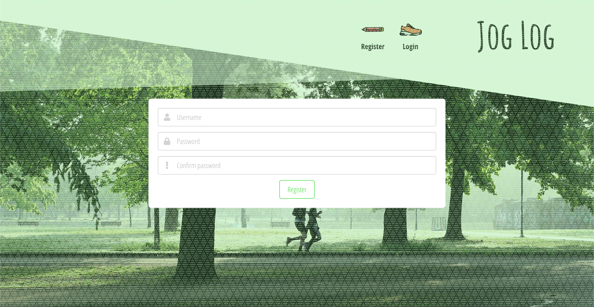
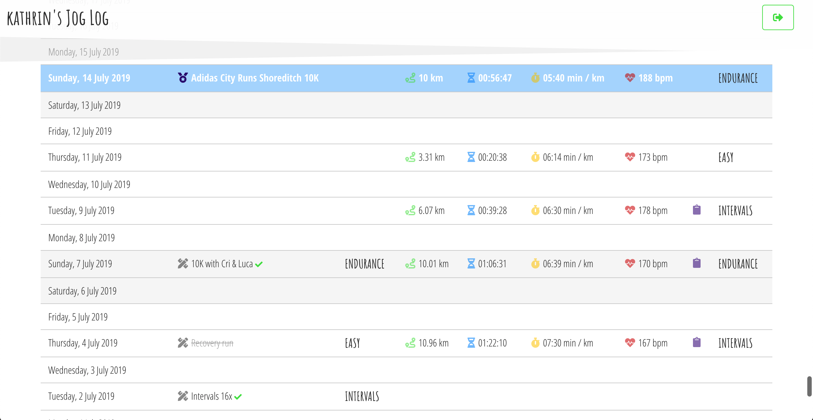
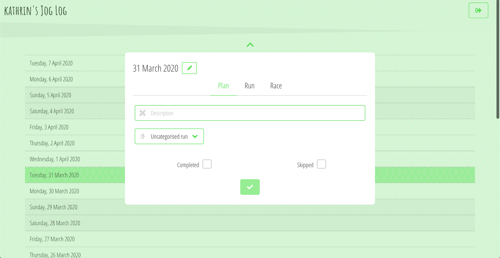
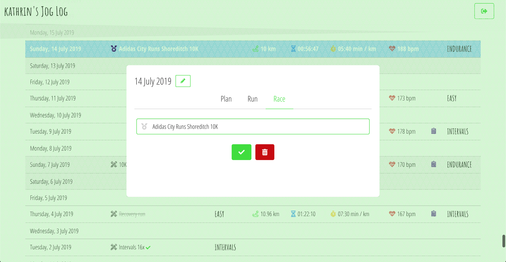

# Jog Log

## Overview

This is a side project I worked on by myself mostly during my job search after finishing the Software Engineering Immersive course at General Assembly. The idea was to keep practicing the use of React, Django and PostgreSQL, but to push my knowledge by setting up a GraphQL API.

Jog Log is allows you to keep track of your running plans and log your actual runs. Inspired by my old system of using Excel Sheets to keep track of race training plans, the app provides a calendar overview in the form of a table, showing the scheduled plans, whether they were completed or skipped, and the statistics tracked of actual runs (e.g. distance, duration, pace and average heart rate). It also allows for scheduling races and for indicating whether plans and runs are of easy, tempo, intervals or endurance category.

You can launch the app on Heroku [here](https://joglog-ke.herokuapp.com/), or find the GitHub repo [here](https://github.com/katheich/joglog).

## Table of contents
1. [Brief](#Brief)
2. [Technologies used](#Technologies-used)
3. [Approach](#Approach)
    - [Planning](#Planning)
    - [Back-end](#Back-end)
    - [Front-end](#Front-end)
    - [File Structure](#File-structure)
4. [Screenshots](#Screenshots)
5. [Potential future features](#Potential-future-features)
6. [Bugs](#Bugs)
7. [Lessons learned](#Lessons-learned)
8. [Credit](#credit)

## Technologies used
- HTML
- SCSS
- Python
- Django
- GraphQL
- Graphene
- Apollo
- PostgreSQL
- JavaScript (ES6)
- React.js
- Webpack
- Heroku
- Git and GitHub
- Bulma
- Google Fonts
- Adobe Photoshop

## Approach

Coming soon!

### Planning

### Back-end

### Front-end

### File structure

## Screenshots

## Potential future features

Coming soon!

## Bugs 

Coming soon!

## Lessons learned

Coming soon!

## Credit

Coming soon!

